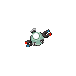

# 081 - Magnemite

## Types

| Version | Type                                                                    |
| :-----: | ----------------------------------------------------------------------: |
| Classic |   |

## Defenses

| Immune x0                          | Resistant ×¼                                                            | Resistant ×½                                                                                                                                                                                                                                                                                                                                 | Normal ×1                                                                                                | Weak ×2                                                                   | Weak ×4                            |
| ---------------------------------- | ----------------------------------------------------------------------- | -------------------------------------------------------------------------------------------------------------------------------------------------------------------------------------------------------------------------------------------------------------------------------------------------------------------------------------------- | -------------------------------------------------------------------------------------------------------- | ------------------------------------------------------------------------- | ---------------------------------- |
|  |   |          |    |   |  |

## Abilities

| Version | Ability                         |
| ------- | ------------------------------- |
| All     | Magnet-Pull / Sturdy / Analytic |

## Base Stats

| Version | HP | Atk | Def | SAtk | SDef | Spd | BST |
| ------- | -- | --- | --- | ---- | ---- | --- | --- |
| All     | 25 | 35  | 70  | 95   | 55   | 45  | 325 |

## Level Up Moves

| Level | Name          | Power | Accuracy | PP | Type                                   | Damage Class                           |
| ----- | ------------- | ----- | -------- | -- | -------------------------------------- | -------------------------------------- |
| 1     | Tackle        | 40    | 100%     | 35 |      |  |
| 1     | Metal-Sound   | -     | 85%      | 40 |        |      |
| 6     | Thunder-Shock | 40    | 100%     | 30 |  |    |
| 11    | Supersonic    | -     | 55%      | 20 |      |      |
| 14    | Sonic-Boom    | -     | 90%      | 20 |      |    |
| 17    | Thunder-Wave  | -     | 90%      | 20 |  |      |
| 22    | Spark         | 65    | 100%     | 20 |  |  |
| 27    | Electro-Ball  | -     | 100%     | 10 |  |    |
| 30    | Lock-On       | -     | -        | 5  |      |      |
| 33    | Magnet-Bomb   | 60    | -        | 20 |        |  |
| 38    | Screech       | -     | 85%      | 40 |      |      |
| 43    | Discharge     | 80    | 100%     | 15 |  |    |
| 46    | Mirror-Shot   | 65    | 85%      | 10 |        |    |
| 49    | Magnet-Rise   | -     | -        | 10 |  |      |
| 54    | Gyro-Ball     | -     | 100%     | 5  |        |  |
| 59    | Zap-Cannon    | 120   | 50%      | 5  |  |    |

## Learnable Moves

| Machine | Name | Power | Accuracy | PP | Type | Damage Class |
| ------- | ---- | ----- | -------- | -- | ---- | ------------ |