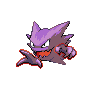

# 093 - Haunter

## Types

| Version | Type                                                                |
| :-----: | ------------------------------------------------------------------: |
| Classic |   |

## Defenses

| Immune x0                                                                     | Resistant ×¼                                                        | Resistant ×½                                                          | Normal ×1                                                                                                                                                                                                                                                                                             | Weak ×2                                                                                                                                             | Weak ×4 |
| ----------------------------------------------------------------------------- | ------------------------------------------------------------------- | --------------------------------------------------------------------- | ----------------------------------------------------------------------------------------------------------------------------------------------------------------------------------------------------------------------------------------------------------------------------------------------------- | --------------------------------------------------------------------------------------------------------------------------------------------------- | ------- |
|   |   |   |         |     |         |

## Abilities

| Version | Ability  |
| ------- | -------- |
| All     | Levitate |

## Base Stats

| Version | HP | Atk | Def | SAtk | SDef | Spd | BST |
| ------- | -- | --- | --- | ---- | ---- | --- | --- |
| All     | 45 | 50  | 45  | 115  | 55   | 95  | 405 |

## Level Up Moves

| Level | Name         | Power | Accuracy | PP | Type                                 | Damage Class                           |
| ----- | ------------ | ----- | -------- | -- | ------------------------------------ | -------------------------------------- |
| 1     | Hypnosis     | -     | 60%      | 20 |  |      |
| 1     | Lick         | 30    | 100%     | 30 |      |  |
| 1     | Spite        | -     | 100%     | 10 |      |      |
| 8     | Mean-Look    | -     | -        | 5  |    |      |
| 12    | Curse        | -     | -        | 10 |      |      |
| 15    | Night-Shade  | -     | 100%     | 15 |      |    |
| 19    | Confuse-Ray  | -     | 100%     | 10 |      |      |
| 22    | Sucker-Punch | 70    | 100%     | 5  |        |  |
| 25    | Shadow-Punch | 60    | -        | 20 |      |  |
| 28    | Payback      | 50    | 100%     | 10 |        |  |
| 33    | Shadow-Ball  | 80    | 100%     | 15 |      |    |
| 39    | Dream-Eater  | 100   | 100%     | 15 |  |    |
| 44    | Dark-Pulse   | 80    | 100%     | 15 |        |    |
| 50    | Destiny-Bond | -     | -        | 5  |      |      |
| 55    | Hex          | 65    | 100%     | 10 |      |    |
| 61    | Nightmare    | -     | 100%     | 15 |      |      |

## Learnable Moves

| Machine | Name | Power | Accuracy | PP | Type | Damage Class |
| ------- | ---- | ----- | -------- | -- | ---- | ------------ |