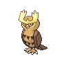

# 164 - Noctowl

## Types

| Version | Type                                                                  |
| :-----: | --------------------------------------------------------------------: |
| Classic |   |

## Defenses

| Immune x0                                                               | Resistant ×¼ | Resistant ×½                                                      | Normal ×1                                                                                                                                                                                                                                                                                                                                                                                                                        | Weak ×2                                                                                                    | Weak ×4 |
| ----------------------------------------------------------------------- | ------------ | ----------------------------------------------------------------- | -------------------------------------------------------------------------------------------------------------------------------------------------------------------------------------------------------------------------------------------------------------------------------------------------------------------------------------------------------------------------------------------------------------------------------- | ---------------------------------------------------------------------------------------------------------- | ------- |
|   |              |   |            |    |         |

## Abilities

| Version | Ability                           |
| ------- | --------------------------------- |
| All     | Insomnia / Keen-Eye / Tinted-Lens |

## Base Stats

| Version | HP  | Atk | Def | SAtk | SDef | Spd | BST |
| ------- | --- | --- | --- | ---- | ---- | --- | --- |
| All     | 100 | 50  | 50  | 86   | 96   | 70  | 452 |

## Level Up Moves

| Level | Name         | Power | Accuracy | PP | Type                                 | Damage Class                           |
| ----- | ------------ | ----- | -------- | -- | ------------------------------------ | -------------------------------------- |
| 1     | Tackle       | 40    | 100%     | 35 |    |  |
| 1     | Growl        | -     | 100%     | 40 |    |      |
| 1     | Hypnosis     | -     | 60%      | 20 |  |      |
| 1     | Sky-Attack   | 140   | 90%      | 5  |    |  |
| 1     | Foresight    | -     | -        | 40 |    |      |
| 9     | Peck         | 35    | 100%     | 35 |    |  |
| 13    | Uproar       | 90    | 100%     | 10 |    |    |
| 17    | Reflect      | -     | -        | 20 |  |      |
| 22    | Confusion    | 50    | 100%     | 25 |  |    |
| 27    | Echoed-Voice | 40    | 100%     | 15 |    |    |
| 32    | Take-Down    | 90    | 85%      | 20 |    |  |
| 37    | Air-Slash    | 75    | 95%      | 15 |    |    |
| 42    | Zen-Headbutt | 80    | 90%      | 15 |  |  |
| 47    | Synchronoise | 120   | 100%     | 10 |  |    |
| 52    | Extrasensory | 80    | 100%     | 20 |  |    |
| 57    | Psycho-Shift | -     | 100%     | 10 |  |      |
| 62    | Roost        | -     | -        | 10 |    |      |
| 67    | Dream-Eater  | 100   | 100%     | 15 |  |    |

## Learnable Moves

| Machine | Name | Power | Accuracy | PP | Type | Damage Class |
| ------- | ---- | ----- | -------- | -- | ---- | ------------ |