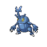

# 214 - Heracross

## Types

| Version | Type                                                                |
| :-----: | ------------------------------------------------------------------: |
| Classic |   |

## Defenses

| Immune x0 | Resistant ×¼ | Resistant ×½                                                                                                                                                                           | Normal ×1                                                                                                                                                                                                                                                                                                                                      | Weak ×2                                                                                                      | Weak ×4                            |
| --------- | ------------ | -------------------------------------------------------------------------------------------------------------------------------------------------------------------------------------- | ---------------------------------------------------------------------------------------------------------------------------------------------------------------------------------------------------------------------------------------------------------------------------------------------------------------------------------------------- | ------------------------------------------------------------------------------------------------------------ | ---------------------------------- |
|           |              |      |          |    |  |

## Abilities

| Version | Ability              |
| ------- | -------------------- |
| All     | Swarm / Guts / Moxie |

## Base Stats

| Version | HP | Atk | Def | SAtk | SDef | Spd | BST |
| ------- | -- | --- | --- | ---- | ---- | --- | --- |
| All     | 80 | 125 | 75  | 40   | 95   | 85  | 500 |

## Level Up Moves

| Level | Name         | Power | Accuracy | PP | Type                                   | Damage Class                           |
| ----- | ------------ | ----- | -------- | -- | -------------------------------------- | -------------------------------------- |
| 1     | Horn-Attack  | 65    | 100%     | 25 |      |  |
| 1     | Tackle       | 40    | 100%     | 35 |      |  |
| 1     | Leer         | -     | 100%     | 30 |      |      |
| 1     | Endure       | -     | -        | 10 |      |      |
| 1     | Night-Slash  | 70    | 100%     | 15 |          |  |
| 7     | Fury-Attack  | 15    | 85%      | 20 |      |  |
| 13    | Aerial-Ace   | 60    | -        | 20 |      |  |
| 19    | Brick-Break  | 75    | 100%     | 15 |  |  |
| 25    | Counter      | -     | 100%     | 20 |  |  |
| 31    | Take-Down    | 90    | 85%      | 20 |      |  |
| 37    | Close-Combat | 120   | 100%     | 5  |  |  |
| 43    | Reversal     | -     | 100%     | 15 |  |  |
| 49    | Feint        | 30    | 100%     | 10 |      |  |
| 55    | Megahorn     | 120   | 85%      | 10 |            |  |

## Learnable Moves

| Machine | Name | Power | Accuracy | PP | Type | Damage Class |
| ------- | ---- | ----- | -------- | -- | ---- | ------------ |