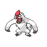

# 288 - Vigoroth

## Types

| Version | Type                               |
| :-----: | ---------------------------------: |
| Classic |  |

## Defenses

| Immune x0                        | Resistant ×¼ | Resistant ×½ | Normal ×1                                                                                                                                                                                                                                                                                                                                                                                                                                                                                                                                                                                                         | Weak ×2                                | Weak ×4 |
| -------------------------------- | ------------ | ------------ | ----------------------------------------------------------------------------------------------------------------------------------------------------------------------------------------------------------------------------------------------------------------------------------------------------------------------------------------------------------------------------------------------------------------------------------------------------------------------------------------------------------------------------------------------------------------------------------------------------------------- | -------------------------------------- | ------- |
|  |              |              |                 |  |         |

## Abilities

| Version | Ability      |
| ------- | ------------ |
| All     | Vital-Spirit |

## Base Stats

| Version | HP | Atk | Def | SAtk | SDef | Spd | BST |
| ------- | -- | --- | --- | ---- | ---- | --- | --- |
| All     | 80 | 80  | 80  | 55   | 55   | 90  | 440 |

## Level Up Moves

| Level | Name         | Power | Accuracy | PP | Type                                   | Damage Class                           |
| ----- | ------------ | ----- | -------- | -- | -------------------------------------- | -------------------------------------- |
| 1     | Scratch      | 40    | 100%     | 35 |      |  |
| 1     | Focus-Energy | -     | -        | 30 |      |      |
| 1     | Encore       | -     | 100%     | 5  |      |      |
| 1     | Uproar       | 90    | 100%     | 10 |      |    |
| 19    | Fury-Swipes  | 18    | 80%      | 15 |      |  |
| 25    | Endure       | -     | -        | 10 |      |      |
| 31    | Slash        | 70    | 100%     | 20 |      |  |
| 37    | Counter      | -     | 100%     | 20 |  |  |
| 43    | Chip-Away    | 70    | 100%     | 20 |      |  |
| 49    | Focus-Punch  | 150   | 100%     | 20 |  |  |
| 55    | Reversal     | -     | 100%     | 15 |  |  |

## Learnable Moves

| Machine | Name | Power | Accuracy | PP | Type | Damage Class |
| ------- | ---- | ----- | -------- | -- | ---- | ------------ |