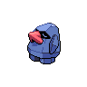

# 299 - Nosepass

## Types

| Version | Type                           |
| :-----: | -----------------------------: |
| Classic |  |

## Defenses

| Immune x0 | Resistant ×¼ | Resistant ×½                                                                                                                                        | Normal ×1                                                                                                                                                                                                                                                                                                                                | Weak ×2                                                                                                                                                                                      | Weak ×4 |
| --------- | ------------ | --------------------------------------------------------------------------------------------------------------------------------------------------- | ---------------------------------------------------------------------------------------------------------------------------------------------------------------------------------------------------------------------------------------------------------------------------------------------------------------------------------------- | -------------------------------------------------------------------------------------------------------------------------------------------------------------------------------------------- | ------- |
|           |              |     |          |      |         |

## Abilities

| Version | Ability                           |
| ------- | --------------------------------- |
| All     | Sturdy / Magnet-Pull / Sand-Force |

## Base Stats

| Version | HP | Atk | Def | SAtk | SDef | Spd | BST |
| ------- | -- | --- | --- | ---- | ---- | --- | --- |
| All     | 30 | 45  | 135 | 45   | 90   | 30  | 375 |

## Level Up Moves

| Level | Name         | Power | Accuracy | PP | Type                                   | Damage Class                           |
| ----- | ------------ | ----- | -------- | -- | -------------------------------------- | -------------------------------------- |
| 1     | Tackle       | 40    | 100%     | 35 |      |  |
| 7     | Harden       | -     | -        | 30 |      |      |
| 13    | Rock-Throw   | 50    | 90%      | 15 |          |  |
| 19    | Block        | -     | -        | 5  |      |      |
| 25    | Thunder-Wave | -     | 90%      | 20 |  |      |
| 31    | Rock-Slide   | 75    | 90%      | 10 |          |  |
| 37    | Sandstorm    | -     | -        | 10 |          |      |
| 43    | Rest         | -     | -        | 10 |    |      |
| 49    | Power-Gem    | 80    | 100%     | 20 |          |    |
| 55    | Discharge    | 80    | 100%     | 15 |  |    |
| 61    | Stone-Edge   | 100   | 80%      | 5  |          |  |
| 67    | Zap-Cannon   | 120   | 50%      | 5  |  |    |
| 73    | Lock-On      | -     | -        | 5  |      |      |
| 79    | Earth-Power  | 90    | 100%     | 10 |      |    |

## Learnable Moves

| Machine | Name | Power | Accuracy | PP | Type | Damage Class |
| ------- | ---- | ----- | -------- | -- | ---- | ------------ |