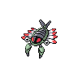

# 347 - Anorith

## Types

| Version | Type                                                        |
| :-----: | ----------------------------------------------------------: |
| Classic |   |

## Defenses

| Immune x0 | Resistant ×¼ | Resistant ×½                                                              | Normal ×1                                                                                                                                                                                                                                                                                                                                                                                                                                                                                              | Weak ×2                                                                                                  | Weak ×4 |
| --------- | ------------ | ------------------------------------------------------------------------- | ------------------------------------------------------------------------------------------------------------------------------------------------------------------------------------------------------------------------------------------------------------------------------------------------------------------------------------------------------------------------------------------------------------------------------------------------------------------------------------------------------ | -------------------------------------------------------------------------------------------------------- | ------- |
|           |              |   |              |    |         |

## Abilities

| Version | Ability                   |
| ------- | ------------------------- |
| All     | Battle-Armor / Swift-Swim |

## Base Stats

| Version | HP | Atk | Def | SAtk | SDef | Spd | BST |
| ------- | -- | --- | --- | ---- | ---- | --- | --- |
| All     | 45 | 95  | 50  | 40   | 50   | 75  | 355 |

## Level Up Moves

| Level | Name          | Power | Accuracy | PP | Type                               | Damage Class                           |
| ----- | ------------- | ----- | -------- | -- | ---------------------------------- | -------------------------------------- |
| 1     | Scratch       | 40    | 100%     | 35 |  |  |
| 1     | Harden        | -     | -        | 30 |  |      |
| 7     | Mud-Sport     | -     | -        | 15 |  |      |
| 13    | Water-Gun     | 40    | 100%     | 25 |    |    |
| 19    | Metal-Claw    | 50    | 95%      | 35 |    |  |
| 25    | Protect       | -     | -        | 10 |  |      |
| 31    | Ancient-Power | 60    | 100%     | 5  |      |    |
| 37    | Fury-Cutter   | 40    | 95%      | 20 |        |  |
| 43    | Slash         | 70    | 100%     | 20 |  |  |
| 49    | Rock-Blast    | 25    | 90%      | 10 |      |  |
| 55    | Crush-Claw    | 75    | 95%      | 10 |  |  |
| 61    | X-Scissor     | 80    | 100%     | 15 |        |  |

## Learnable Moves

| Machine | Name | Power | Accuracy | PP | Type | Damage Class |
| ------- | ---- | ----- | -------- | -- | ---- | ------------ |