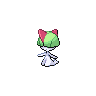

# Cerulean city

=== "Elekid"

    | Trainer                                                                                   | 1                                                                                                | 2                                                                                              | 3                                                                                                    | 4                                                                                                |
    | ----------------------------------------------------------------------------------------- | ------------------------------------------------------------------------------------------------ | ---------------------------------------------------------------------------------------------- | ---------------------------------------------------------------------------------------------------- | ------------------------------------------------------------------------------------------------ |
    | Rival Blue   |   [Golbat](/fire-red-omega-wiki/pokemon/042)  Lv. 18 |   [Ralts](/fire-red-omega-wiki/pokemon/280)  Lv. 19 |   [Snubbull](/fire-red-omega-wiki/pokemon/209)  Lv. 19 |   [Elekid](/fire-red-omega-wiki/pokemon/239)  Lv. 21 |

=== "Smoochum"

    | Trainer                                                                                   | 1                                                                                                | 2                                                                                                    | 3                                                                                            | 4                                                                                                    |
    | ----------------------------------------------------------------------------------------- | ------------------------------------------------------------------------------------------------ | ---------------------------------------------------------------------------------------------------- | -------------------------------------------------------------------------------------------- | ---------------------------------------------------------------------------------------------------- |
    | Rival Blue   |   [Golbat](/fire-red-omega-wiki/pokemon/042)  Lv. 18 |   [Snubbull](/fire-red-omega-wiki/pokemon/209)  Lv. 19 |   [Abra](/fire-red-omega-wiki/pokemon/063)  Lv. 19 |   [Smoochum](/fire-red-omega-wiki/pokemon/238)  Lv. 21 |

=== "Magby"

    | Trainer                                                                                   | 1                                                                                                | 2                                                                                                    | 3                                                                                                | 4                                                                                              |
    | ----------------------------------------------------------------------------------------- | ------------------------------------------------------------------------------------------------ | ---------------------------------------------------------------------------------------------------- | ------------------------------------------------------------------------------------------------ | ---------------------------------------------------------------------------------------------- |
    | Rival Blue   |   [Golbat](/fire-red-omega-wiki/pokemon/042)  Lv. 18 |   [Snubbull](/fire-red-omega-wiki/pokemon/209)  Lv. 19 |   [Gastly](/fire-red-omega-wiki/pokemon/092)  Lv. 19 |   [Magby](/fire-red-omega-wiki/pokemon/240)  Lv. 21 |

 

## Rival Blue

=== "Elekid"

    |                             | Item                                                                 | Nature | Ability     | Moves                                                                                   |
    | ---------------------------------------------------------------------------------------------------- | -------------------------------------------------------------------- | ------ | ----------- | --------------------------------------------------------------------------------------- |
    |   [Golbat](/fire-red-omega-wiki/pokemon/042)  Lv. 18     | N/A                                                                  | Calm   | Inner-Focus | <ul><li>Screech</li><li>Leech-Life</li><li>Astonish</li><li>Bite</li></ul>              |
    |   [Ralts](/fire-red-omega-wiki/pokemon/280)  Lv. 19       | N/A                                                                  | Mild   | Synchronize | <ul><li>Confusion</li><li>Growl</li><li>Double-Team</li><li>Teleport</li></ul>          |
    |   [Snubbull](/fire-red-omega-wiki/pokemon/209)  Lv. 19 | N/A                                                                  | Impish | Intimidate  | <ul><li>Tail-Whip</li><li>Charm</li><li>Bite</li><li>Lick</li></ul>                     |
    |   [Elekid](/fire-red-omega-wiki/pokemon/239)  Lv. 21     |    Sitrus berry | Lonely | Volt-Absorb | <ul><li>Thunder-Shock</li><li>Karate-Chop</li><li>Swift</li><li>Thunder-Punch</li></ul> |

=== "Smoochum"

    |                             | Item                                                                 | Nature  | Ability     | Moves                                                                          |
    | ---------------------------------------------------------------------------------------------------- | -------------------------------------------------------------------- | ------- | ----------- | ------------------------------------------------------------------------------ |
    |   [Golbat](/fire-red-omega-wiki/pokemon/042)  Lv. 18     | N/A                                                                  | Calm    | Inner-Focus | <ul><li>Screech</li><li>Leech-Life</li><li>Astonish</li><li>Bite</li></ul>     |
    |   [Snubbull](/fire-red-omega-wiki/pokemon/209)  Lv. 19 | N/A                                                                  | Impish  | Intimidate  | <ul><li>Tail-Whip</li><li>Charm</li><li>Bite</li><li>Lick</li></ul>            |
    |   [Abra](/fire-red-omega-wiki/pokemon/063)  Lv. 19         | N/A                                                                  | Serious | Synchronize | <ul><li>Teleport</li><li>N/A</li><li>N/A</li><li>N/A</li></ul>                 |
    |   [Smoochum](/fire-red-omega-wiki/pokemon/238)  Lv. 21 |    Sitrus berry | Calm    | Insomnia    | <ul><li>Powder-Snow</li><li>Confusion</li><li>Lick</li><li>Ice-Punch</li></ul> |

=== "Magby"

    |                             | Item                                                                 | Nature | Ability     | Moves                                                                            |
    | ---------------------------------------------------------------------------------------------------- | -------------------------------------------------------------------- | ------ | ----------- | -------------------------------------------------------------------------------- |
    |   [Golbat](/fire-red-omega-wiki/pokemon/042)  Lv. 18     | N/A                                                                  | Calm   | Inner-Focus | <ul><li>Screech</li><li>Leech-Life</li><li>Astonish</li><li>Bite</li></ul>       |
    |   [Snubbull](/fire-red-omega-wiki/pokemon/209)  Lv. 19 | N/A                                                                  | Impish | Intimidate  | <ul><li>Tail-Whip</li><li>Charm</li><li>Bite</li><li>Lick</li></ul>              |
    |   [Gastly](/fire-red-omega-wiki/pokemon/092)  Lv. 19     | N/A                                                                  | Calm   | Levitate    | <ul><li>Lick</li><li>Spite</li><li>Curse</li><li>Night-Shade</li></ul>           |
    |   [Magby](/fire-red-omega-wiki/pokemon/240)  Lv. 21       |    Sitrus berry | Sassy  | Flash-Fire  | <ul><li>Ember</li><li>Karate-Chop</li><li>Sunny-Day</li><li>Fire-Punch</li></ul> |