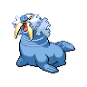
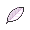

# Route 22

=== "Elekid"

    | Trainer                                                                                   | 1                                                                                             | 2                                                                                               |
    | ----------------------------------------------------------------------------------------- | --------------------------------------------------------------------------------------------- | ----------------------------------------------------------------------------------------------- |
    | Rival Blue   |   [Zubat](/fire-red-omega-wiki/pokemon/041)  Lv. 9 |   [Elekid](/fire-red-omega-wiki/pokemon/239)  Lv. 9 |

=== "Magby"

    | Trainer                                                                                   | 1                                                                                             | 2                                                                                             |
    | ----------------------------------------------------------------------------------------- | --------------------------------------------------------------------------------------------- | --------------------------------------------------------------------------------------------- |
    | Rival Blue   |   [Zubat](/fire-red-omega-wiki/pokemon/041)  Lv. 9 |   [Magby](/fire-red-omega-wiki/pokemon/240)  Lv. 9 |

=== "Smoochum"

    | Trainer                                                                                   | 1                                                                                             | 2                                                                                                   |
    | ----------------------------------------------------------------------------------------- | --------------------------------------------------------------------------------------------- | --------------------------------------------------------------------------------------------------- |
    | Rival Blue   |   [Zubat](/fire-red-omega-wiki/pokemon/041)  Lv. 9 |   [Smoochum](/fire-red-omega-wiki/pokemon/238)  Lv. 9 |

 

=== "Elekid"

    | Trainer                                                                                                   | 1                                                                                                | 2                                                                                                  | 3                                                                                                    | 4                                                                                                    | 5                                                                                                      | 6                                                                                                        |
    | --------------------------------------------------------------------------------------------------------- | ------------------------------------------------------------------------------------------------ | -------------------------------------------------------------------------------------------------- | ---------------------------------------------------------------------------------------------------- | ---------------------------------------------------------------------------------------------------- | ------------------------------------------------------------------------------------------------------ | -------------------------------------------------------------------------------------------------------- |
    | Rival Blue (Final)   |   [Crobat](/fire-red-omega-wiki/pokemon/169)  Lv. 56 |   [Walrein](/fire-red-omega-wiki/pokemon/365)  Lv. 58 |   [Sceptile](/fire-red-omega-wiki/pokemon/254)  Lv. 59 |   [Houndoom](/fire-red-omega-wiki/pokemon/229)  Lv. 58 |   [Gardevoir](/fire-red-omega-wiki/pokemon/282)  Lv. 59 |   [Electabuzz](/fire-red-omega-wiki/pokemon/125)  Lv. 61 |

=== "Smoochum"

    | Trainer                                                                                                   | 1                                                                                                | 2                                                                                                    | 3                                                                                                    | 4                                                                                                    | 5                                                                                                    | 6                                                                                            |
    | --------------------------------------------------------------------------------------------------------- | ------------------------------------------------------------------------------------------------ | ---------------------------------------------------------------------------------------------------- | ---------------------------------------------------------------------------------------------------- | ---------------------------------------------------------------------------------------------------- | ---------------------------------------------------------------------------------------------------- | -------------------------------------------------------------------------------------------- |
    | Rival Blue (Final)   |   [Crobat](/fire-red-omega-wiki/pokemon/169)  Lv. 56 |   [Houndoom](/fire-red-omega-wiki/pokemon/229)  Lv. 58 |   [Ampharos](/fire-red-omega-wiki/pokemon/181)  Lv. 58 |   [Venusaur](/fire-red-omega-wiki/pokemon/003)  Lv. 59 |   [Alakazam](/fire-red-omega-wiki/pokemon/065)  Lv. 59 |   [Jynx](/fire-red-omega-wiki/pokemon/124)  Lv. 61 |

=== "Magby"

    | Trainer                                                                                                   | 1                                                                                                | 2                                                                                                  | 3                                                                                                    | 4                                                                                                | 5                                                                                                    | 6                                                                                                |
    | --------------------------------------------------------------------------------------------------------- | ------------------------------------------------------------------------------------------------ | -------------------------------------------------------------------------------------------------- | ---------------------------------------------------------------------------------------------------- | ------------------------------------------------------------------------------------------------ | ---------------------------------------------------------------------------------------------------- | ------------------------------------------------------------------------------------------------ |
    | Rival Blue (Final)   |   [Crobat](/fire-red-omega-wiki/pokemon/169)  Lv. 56 |   [Walrein](/fire-red-omega-wiki/pokemon/365)  Lv. 58 |   [Ampharos](/fire-red-omega-wiki/pokemon/181)  Lv. 58 |   [Magmar](/fire-red-omega-wiki/pokemon/126)  Lv. 61 |   [Meganium](/fire-red-omega-wiki/pokemon/154)  Lv. 59 |   [Gengar](/fire-red-omega-wiki/pokemon/094)  Lv. 59 |

 

## Rival Blue

=== "Elekid"

    |                        | Item                                                           | Nature  | Ability     | Moves                                                                         |
    | ----------------------------------------------------------------------------------------------- | -------------------------------------------------------------- | ------- | ----------- | ----------------------------------------------------------------------------- |
    |   [Zubat](/fire-red-omega-wiki/pokemon/041)  Lv. 9   | N/A                                                            | Relaxed | Inner-Focus | <ul><li>Leech-Life</li><li>Astonish</li><li>N/A</li><li>N/A</li></ul>         |
    |   [Elekid](/fire-red-omega-wiki/pokemon/239)  Lv. 9 |    Oran berry | Hardy   | Volt-Absorb | <ul><li>Quick-Attack</li><li>Leer</li><li>Thunder-Shock</li><li>N/A</li></ul> |

=== "Magby"

    |                      | Item                                                           | Nature  | Ability     | Moves                                                                 |
    | --------------------------------------------------------------------------------------------- | -------------------------------------------------------------- | ------- | ----------- | --------------------------------------------------------------------- |
    |   [Zubat](/fire-red-omega-wiki/pokemon/041)  Lv. 9 | N/A                                                            | Relaxed | Inner-Focus | <ul><li>Leech-Life</li><li>Astonish</li><li>N/A</li><li>N/A</li></ul> |
    |   [Magby](/fire-red-omega-wiki/pokemon/240)  Lv. 9 |    Oran berry | Gentle  | Flash-Fire  | <ul><li>Scratch</li><li>Leer</li><li>Ember</li><li>N/A</li></ul>      |

=== "Smoochum"

    |                            | Item                                                           | Nature  | Ability     | Moves                                                                 |
    | --------------------------------------------------------------------------------------------------- | -------------------------------------------------------------- | ------- | ----------- | --------------------------------------------------------------------- |
    |   [Zubat](/fire-red-omega-wiki/pokemon/041)  Lv. 9       | N/A                                                            | Relaxed | Inner-Focus | <ul><li>Leech-Life</li><li>Astonish</li><li>N/A</li><li>N/A</li></ul> |
    |   [Smoochum](/fire-red-omega-wiki/pokemon/238)  Lv. 9 |    Oran berry | Careful | Insomnia    | <ul><li>Pound</li><li>Growl</li><li>Powder-Snow</li><li>N/A</li></ul> |

## Rival Blue (Final)

=== "Elekid"

    |                         | Item                                                                 | Nature  | Ability     | Moves                                                                                 |
    | -------------------------------------------------------------------------------------------------------- | -------------------------------------------------------------------- | ------- | ----------- | ------------------------------------------------------------------------------------- |
    |   [Crobat](/fire-red-omega-wiki/pokemon/169)  Lv. 56         | N/A                                                                  | Relaxed | Inner-Focus | <ul><li>Aerial-Ace</li><li>Toxic</li><li>Confuse-Ray</li><li>Sludge-Bomb</li></ul>    |
    |   [Walrein](/fire-red-omega-wiki/pokemon/365)  Lv. 58       |    Chesto berry | Modest  | Thick-Fat   | <ul><li>Surf</li><li>Ice-Beam</li><li>Rain-Dance</li><li>Rest</li></ul>               |
    |   [Sceptile](/fire-red-omega-wiki/pokemon/254)  Lv. 59     | N/A                                                                  | Modest  | Overgrow    | <ul><li>Substitute</li><li>Leech-Seed</li><li>Frenzy-Plant</li><li>Crunch</li></ul>   |
    |   [Houndoom](/fire-red-omega-wiki/pokemon/229)  Lv. 58     |    Lum berry          | Rash    | Early-Bird  | <ul><li>Solar-Beam</li><li>Sunny-Day</li><li>Fire-Blast</li><li>Crunch</li></ul>      |
    |   [Gardevoir](/fire-red-omega-wiki/pokemon/282)  Lv. 59   | N/A                                                                  | Adamant | Synchronize | <ul><li>Calm-Mind</li><li>Psychic</li><li>Magical-Leaf</li><li>Thunderbolt</li></ul>  |
    |   [Electabuzz](/fire-red-omega-wiki/pokemon/125)  Lv. 61 | N/A                                                                  | Timid   | Volt-Absorb | <ul><li>Volt-Tackle</li><li>Cross-Chop</li><li>Ice-Punch</li><li>Fire-Punch</li></ul> |

=== "Smoochum"

    |                     | Item                                                           | Nature  | Ability     | Moves                                                                                 |
    | ---------------------------------------------------------------------------------------------------- | -------------------------------------------------------------- | ------- | ----------- | ------------------------------------------------------------------------------------- |
    |   [Crobat](/fire-red-omega-wiki/pokemon/169)  Lv. 56     | N/A                                                            | Relaxed | Inner-Focus | <ul><li>Aerial-Ace</li><li>Toxic</li><li>Confuse-Ray</li><li>Sludge-Bomb</li></ul>    |
    |   [Houndoom](/fire-red-omega-wiki/pokemon/229)  Lv. 58 |    Lum berry    | Rash    | Early-Bird  | <ul><li>Solar-Beam</li><li>Sunny-Day</li><li>Fire-Blast</li><li>Crunch</li></ul>      |
    |   [Ampharos](/fire-red-omega-wiki/pokemon/181)  Lv. 58 | N/A                                                            | Quirky  | Static      | <ul><li>Thunder-Wave</li><li>Signal-Beam</li><li>Rain-Dance</li><li>Thunder</li></ul> |
    |   [Venusaur](/fire-red-omega-wiki/pokemon/003)  Lv. 59 | N/A                                                            | Relaxed | Overgrow    | <ul><li>Frenzy-Plant</li><li>Sludge-Bomb</li><li>Sleep-Powder</li><li>Toxic</li></ul> |
    |   [Alakazam](/fire-red-omega-wiki/pokemon/065)  Lv. 59 | N/A                                                            | Lonely  | Synchronize | <ul><li>Psychic</li><li>Recover</li><li>Ice-Punch</li><li>Thunder-Punch</li></ul>     |
    |   [Jynx](/fire-red-omega-wiki/pokemon/124)  Lv. 61         |    White herb | Quirky  | Insomnia    | <ul><li>Ice-Beam</li><li>Lovely-Kiss</li><li>Psycho-Boost</li><li>Psychic</li></ul>   |

=== "Magby"

    |                     | Item                                                                 | Nature  | Ability     | Moves                                                                                  |
    | ---------------------------------------------------------------------------------------------------- | -------------------------------------------------------------------- | ------- | ----------- | -------------------------------------------------------------------------------------- |
    |   [Crobat](/fire-red-omega-wiki/pokemon/169)  Lv. 56     | N/A                                                                  | Relaxed | Inner-Focus | <ul><li>Aerial-Ace</li><li>Toxic</li><li>Confuse-Ray</li><li>Sludge-Bomb</li></ul>     |
    |   [Walrein](/fire-red-omega-wiki/pokemon/365)  Lv. 58   |    Chesto berry | Modest  | Thick-Fat   | <ul><li>Surf</li><li>Ice-Beam</li><li>Rain-Dance</li><li>Rest</li></ul>                |
    |   [Ampharos](/fire-red-omega-wiki/pokemon/181)  Lv. 58 | N/A                                                                  | Quirky  | Static      | <ul><li>Thunder-Wave</li><li>Signal-Beam</li><li>Rain-Dance</li><li>Thunder</li></ul>  |
    |   [Magmar](/fire-red-omega-wiki/pokemon/126)  Lv. 61     |    White herb       | Jolly   | Flash-Fire  | <ul><li>Overheat</li><li>Thunder-Punch</li><li>Fire-Blast</li><li>Cross-Chop</li></ul> |
    |   [Meganium](/fire-red-omega-wiki/pokemon/154)  Lv. 59 | N/A                                                                  | Naughty | Overgrow    | <ul><li>Light-Screen</li><li>Reflect</li><li>Synthesis</li><li>Frenzy-Plant</li></ul>  |
    |   [Gengar](/fire-red-omega-wiki/pokemon/094)  Lv. 59     | N/A                                                                  | Adamant | Levitate    | <ul><li>Thunderbolt</li><li>Hypnosis</li><li>Dream-Eater</li><li>Ice-Punch</li></ul>   |